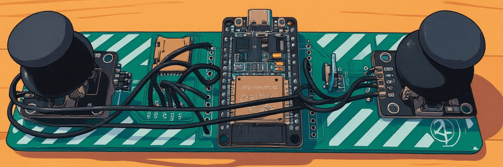
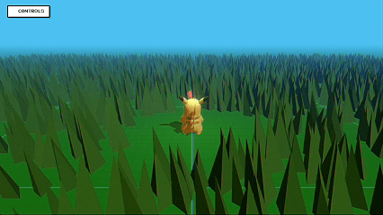

# ESP32 Hotspot Controller: SD Card Games

This repository was created to host some mini games for my ESP32-S3 Hostpot Controller.


All of the games seek a Websocket connection because that is how the controller communicates with the web browser.  There is also an InputManager function that lets you use Keyboard controls like WASD / Arrow Keys. 

Choose your desired mini game:
1) Navigate to /src/mini_games/
2) Find a mini game that you want to try
3) Update main.jsx
4) ``` npm run dev ```
5) Open ```localhost``` and play!

## Demos
<p>Pikachu Simulation </p>



<details>
<summary><b>Click to see more demo gifs</b></summary>
<p>Cube Character Simulation</p>


</details>

## CC Attribution's
Pikachu Model Information:
* title:	Pikachu
* source:	https://sketchfab.com/3d-models/pikachu-37c740f674cd4719a1d1d2970bbe8c30
* author:	Raghav Gupta (https://sketchfab.com/raghav-wd)

Low Poly Grass Model Information:
* title:	Low Poly Grass
* source:	https://sketchfab.com/3d-models/low-poly-grass-5857f3c5c97745bb99c1df22ba5b9416
* author:	RM_Way (https://sketchfab.com/FC_TUIN)